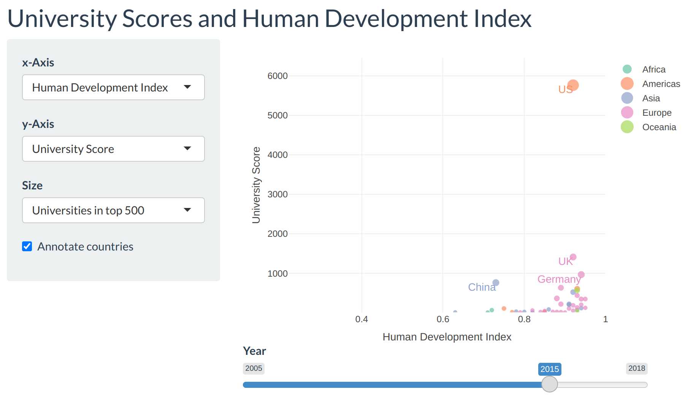
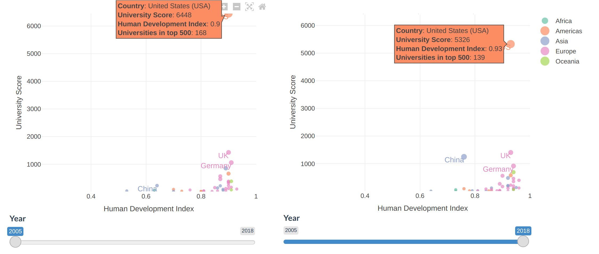
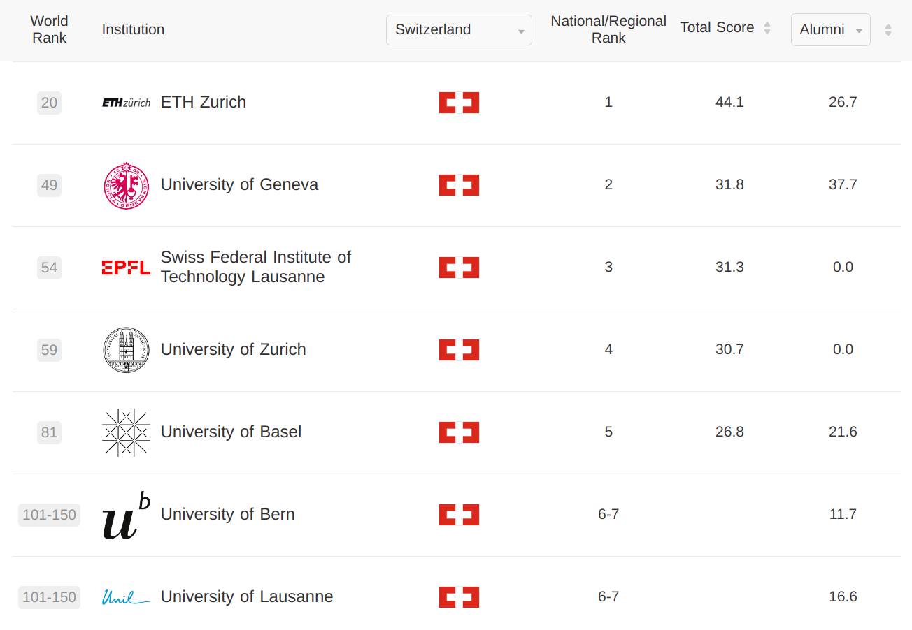

# Human development

## Interactive app

In order to explore the relationships between the university rankings and the HDI indicators, an interactive R shiny app was built and published here: https://aimfeld.shinyapps.io/uni-ranks. The source code and data is available on [Github](https://github.com/aimfeld/uni-ranks).

The user interface allows for selecting an indicator for the x-axis, y-axis, and marker size. Development over time can be observed by dragging the year slider. Finally, some countries of interest annotations can be toggled on and off. Since the university ranking data only spans the years 2005-2018, the time range is adjusted dynamically when selecting the indicators.

The app is inspired by the famous [Gapminder](https://www.gapminder.org/) animations, presented by Hans Rosling in a very entertaining [TED talk](https://www.ted.com/talks/hans_rosling_the_best_stats_you_ve_ever_seen).

## University scores and human development

In terms of university scores, the US was dominating with 168 universities in the top 500 in 2005. Over the years, China has been catching up in number and ranking of top 500 universities as well as in human development. The decline in combined university scores of the US from 2005 to 2018 may be explained by Chinese universities entering the top 500 and displacing some of the lower ranked US universities. However, US dominance remains very strong. In 2023, the top ranks are is still heavily dominated by US universities. In fact, according to the [Shanghai rankings 2023](https://www.shanghairanking.com/rankings/arwu/2023), 20 of the top 30 are US universities whereas only 2 are Chinese. These are the top 10 universities in 2023:

The relationship between university scores and HDI is unclear. However, an exponential relationship emerges if we look at university score _per capita_, correcting for country population size. Notably, Switzerland comes out on top due to its small country size and comparatively high number of quality universities.

\begin{center}
\includegraphics[width=0.7\textwidth]{img/hdi-uni-score-pmc-2017.png}
\end{center}

A very similar exponential pattern can be found between Gross National Income (GNI) and university score per capita. This is not surprising, since the GNI is part of the HDI.

\begin{center}
\includegraphics[width=0.7\textwidth]{img/gnipc-uni-score-pmc-2017.png}
\end{center}

## Education and gender inequality

We might hypothesize that better education leads to less gender inequality. Indeed, the higher the university score per capita, the lower the gender inequality index. Asian countries seem to be behind in terms of gender equality and education, while European countries are doing quite well. Although the situation has been improving in Asia over time, as can be seen interactively by using the year slider.

\begin{center}
\includegraphics[width=0.7\textwidth]{img/uni-score-pmc-gii-2017.png}
\end{center}

While it's tempting to infer a causal relationship between education and gender equality, both of these variables may be mediated by hidden variables such as economic development or other factors.

## Switzerland

For being a very small country, Switzerland is doing very well in terms of top ranking universities and human development. There are consistently around 8 Swiss universities in the top 500. In 2023, the top Swiss universities include the following, spearheaded by the ETH Zürich with a rank of 20.

With respect to human development, Switzerland is equalled only by Norway with a HDI of 0.96.

\begin{center}
\includegraphics[width=0.7\textwidth]{img/hdi-uni-score-swiss-2018.png}
\end{center}
